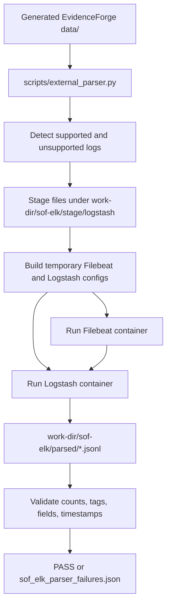

# SOF-ELK Harness

This harness validates generated EvidenceForge logs by running SOF-ELK's
Filebeat and Logstash path without Elasticsearch. It downloads a pinned SOF-ELK
checkout outside the repository, stages generated logs under SOF-ELK's watched
paths, runs containerized Filebeat and Logstash, and writes parsed events to
JSONL.

## Runtime Flow



The full-dataset command is:

```bash
uv run python scripts/external_parser.py <data-dir> \
  --work-dir <work-dir> \
  --timeout 180
```

If `--work-dir` is omitted, the runner creates a temporary directory with an
`eforge-external-parsers-` prefix.

## SOF-ELK Assets

The SOF-ELK checkout is downloaded by the host-side harness, not inside the
containers. It is not vendored into this repository.

Defaults:

| Item | Source |
| --- | --- |
| SOF-ELK repository | `https://github.com/philhagen/sof-elk.git` |
| SOF-ELK commit | `SOF_ELK_COMMIT` in `src/evidenceforge/external_parsers/sof_elk_zeek.py` |
| Filebeat image | `FILEBEAT_IMAGE` in `src/evidenceforge/external_parsers/sof_elk_zeek.py` |
| Logstash image | `LOGSTASH_IMAGE` in `src/evidenceforge/external_parsers/sof_elk_zeek.py` |

Set `EFORGE_EXTERNAL_CACHE_DIR` to control where SOF-ELK is cached. If unset,
the harness uses `$XDG_CACHE_HOME/evidenceforge/external-parsers` or
`~/.cache/evidenceforge/external-parsers`.

The checkout is mounted read-only into containers at:

```text
/usr/local/sof-elk
```

## Containers

One combined SOF-ELK run starts one Logstash container and one Filebeat
container for all supported log families in that dataset.

Expected container names:

```text
eforge-logstash-<runid>
eforge-filebeat-<runid>
```

Both containers run on an isolated container network and are removed in a
`finally` block. Interrupted runs can still leave containers behind. Find them
with:

```bash
docker ps -a --filter label=evidenceforge.external_parser=sof-elk
```

The same label is used for cleanup visibility:

```text
evidenceforge.external_parser=sof-elk
```

## Temporary Configs

For each run, the harness writes temporary runtime configuration under:

```text
<work-dir>/sof-elk/runtime-config/
```

Important paths:

| Path | Purpose |
| --- | --- |
| `pipeline/` | Logstash wrapper plus copied SOF-ELK filters |
| `filebeat.yml` | Filebeat config loading `inputs.d/*.yml` |
| `filebeat-inputs/` | Copied SOF-ELK Filebeat inputs plus supplemental EvidenceForge Zeek inputs |

The Logstash pipeline uses SOF-ELK filter files unchanged, adds a small
`event.original` capture wrapper, and replaces Elasticsearch output with JSONL
file output.

## Staging Layout

Generated files are copied into the SOF-ELK collection shape under:

```text
<work-dir>/sof-elk/stage/logstash/
```

SOF-ELK then sees that directory mounted as `/logstash`.

| EvidenceForge file | Staged SOF-ELK file |
| --- | --- |
| `<sensor>/conn.json` | `/logstash/zeek/<sensor>/conn.log` |
| `<sensor>/dns.json` | `/logstash/zeek/<sensor>/dns.log` |
| `zeek_conn.json` | `/logstash/zeek/default/conn.log` |
| `zeek_dns.json` | `/logstash/zeek/default/dns.log` |
| `<sensor>/<year>/cisco_asa.log` | `/logstash/syslog/<year>/<sensor>/cisco_asa.log` |
| `<sensor>/cisco_asa.log` | `/logstash/syslog/<inferred-year>/<sensor>/cisco_asa.log` |
| `<host>/web_access.log` | `/logstash/httpd/<host>/web_access.log` |
| `web_access.log` | `/logstash/httpd/default/web_access.log` |
| `<host>/<year>/syslog.log` | `/logstash/syslog/<year>/<host>/syslog.log` |
| `<host>/syslog.log` | `/logstash/syslog/<inferred-year>/<host>/syslog.log` |

For Zeek, the same basename mapping applies for all supported Zeek files:
`http.json` to `http.log`, `ssl.json` to `ssl.log`, and so on. Flat generated
files such as `zeek_http.json` are staged under the synthetic `default` sensor.

Year-partitioned syslog-family paths matter. SOF-ELK uses the archive path to
recover the year for RFC3164/BSD timestamps.

## Output Artifacts

Given `--work-dir <work-dir>`, useful artifacts are:

| Path | Purpose |
| --- | --- |
| `<work-dir>/sof-elk/stage/logstash/...` | All staged files as SOF-ELK sees them |
| `<work-dir>/sof-elk/runtime-config/pipeline/` | Temporary Logstash pipeline wrapper plus copied SOF-ELK filters |
| `<work-dir>/sof-elk/runtime-config/filebeat.yml` | Filebeat config for generated inputs |
| `<work-dir>/sof-elk/runtime-config/filebeat-inputs/` | Copied Filebeat inputs and supplemental Zeek inputs |
| `<work-dir>/sof-elk/parsed/*.jsonl` | Parsed events by SOF-ELK label type |
| `<work-dir>/sof-elk/parsed/sof_elk_parser_failures.json` | Structured failure report |
| `<work-dir>/sof-elk/pipeline-logs/filebeat.log` | Filebeat log |
| `<work-dir>/sof-elk/pipeline-logs/logstash.log` | Logstash log |

The failure report includes expected and observed counts, source paths, parsed
output paths, fatal tag counts, and representative samples with
`event.original`.

## Validation Rules

The harness fails when:

- Logstash config validation fails.
- Filebeat or Logstash exits unexpectedly.
- Output count does not match staged input count.
- A fatal parser tag is present.
- Required normalized fields are missing.
- Zeek DNS answers or TTLs disappear when the raw input had them.
- Syslog-family parsed `@timestamp` year does not match the staged source year.

Ignored optional enrichment tags are not warnings. They remain visible in raw
parsed JSONL and must be registered in the shared tag policy before they are
ignored.
