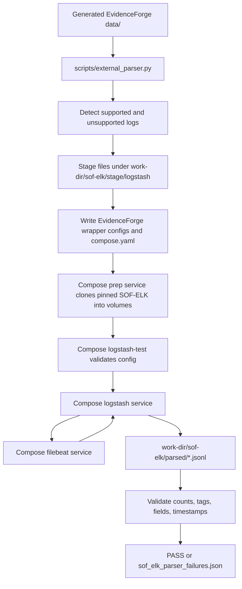

# SOF-ELK® Harness

This harness validates generated EvidenceForge logs by running SOF-ELK's
Filebeat and Logstash path without Elasticsearch. It requires Docker Compose v2
or Podman Compose and uses pinned Elastic OSS Filebeat and Logstash container
images. A short-lived prep service downloads the pinned SOF-ELK repo inside
Compose-managed volumes, copies selected SOF-ELK configs into an ephemeral
runtime-config volume, and removes those volumes during cleanup.

EvidenceForge does not vendor SOF-ELK and does not copy SOF-ELK GPL configs
into the repository or host work directory. The host work directory contains
only EvidenceForge-owned wrapper config, staged generated logs, parsed JSONL,
pipeline logs, reports, `compose.yaml`, and the prep script.

## Runtime Flow



The full-dataset command is:

```bash
uv run python scripts/external_parser.py <data-dir> \
  --work-dir <work-dir> \
  --timeout 180
```

The script requires an explicit `OUTPUT_TARGET.txt` marker set to `sof-elk`
before it performs discovery, staging, or Compose startup. Legacy datasets with
no marker and datasets marked `default` must be regenerated with
`eforge generate --target sof-elk` before they can enter this SOF-ELK pipeline.

If `--work-dir` is omitted, the runner creates a temporary directory with an
`eforge-external-parsers-` prefix.

If `--work-dir` is reused, the harness treats `<work-dir>/sof-elk` as a fresh
run area. It clears EvidenceForge-owned transient directories before staging
input so Filebeat registry offsets, old parsed JSONL, and old pipeline logs
cannot affect the next validation run.

## Compose Runtime

The runner detects `docker compose` first, then `podman compose`. To force a
runtime:

```bash
uv run python scripts/external_parser.py <data-dir> --runtime podman
```

The generated Compose project name is unique per run:

```text
eforge-sof-elk-<runid>
```

Services:

| Service | Purpose |
| --- | --- |
| `prep` | Clone and pin SOF-ELK, verify required files, copy selected configs into the runtime volume |
| `logstash-test` | Run Logstash `--config.test_and_exit` |
| `logstash` | Parse Filebeat-delivered events |
| `filebeat` | Read staged `/logstash/...` files and send events to Logstash |

The Python orchestrator still owns discovery, staging, progress reporting,
output polling, report validation, log capture, and cleanup.

## SOF-ELK Assets

The prep service uses:

| Item | Source |
| --- | --- |
| Prep image | `alpine/git:2.49.1` |
| SOF-ELK repository | `https://github.com/philhagen/sof-elk.git` |
| SOF-ELK commit | `SOF_ELK_COMMIT` in `src/evidenceforge/external_parsers/sof_elk_zeek.py` |
| Filebeat OSS image | `FILEBEAT_IMAGE` in `src/evidenceforge/external_parsers/sof_elk_zeek.py` |
| Logstash OSS image | `LOGSTASH_IMAGE` in `src/evidenceforge/external_parsers/sof_elk_zeek.py` |

The prep service clones SOF-ELK into a Compose-managed `sof_elk_checkout`
volume, verifies `git rev-parse HEAD`, and checks every required filter/input
file before copying selected files into a Compose-managed `runtime_config`
volume. Logstash and Filebeat mount those volumes read-only.

The Elastic runtime containers are separate from the SOF-ELK checkout and are
pinned to OSS image repositories in code. Keep those constants on `*-oss` images
unless there is a deliberate licensing and compatibility review.

There is no `EFORGE_EXTERNAL_CACHE_DIR` path and no host-side SOF-ELK checkout
in normal operation.

## Cleanup

The harness calls:

```bash
docker compose -f <work-dir>/sof-elk/compose.yaml -p eforge-sof-elk-<runid> down -v --remove-orphans
```

or the equivalent `podman compose` command. The `-v` flag removes the
Compose-managed SOF-ELK checkout/config volumes.

Interrupted runs can still leave containers, networks, or volumes behind. Look
for the generated project name or labels:

```bash
docker ps -a --filter label=evidenceforge.external_parser=sof-elk
docker volume ls --filter label=com.docker.compose.project=eforge-sof-elk-<runid>
```

## Host-Side Configs

For each run, EvidenceForge writes host-side config inputs under:

```text
<work-dir>/sof-elk/runtime-config-src/
```

Important paths:

| Path | Purpose |
| --- | --- |
| `pipeline/0000-input-beats.conf` | EvidenceForge-owned Beats input wrapper; preserves SOF-ELK's `process_archive` and `filebeat` tags |
| `pipeline/0001-capture-original.conf` | EvidenceForge-owned `event.original` capture wrapper |
| `pipeline/9999-output-jsonl.conf` | EvidenceForge-owned JSONL output wrapper |
| `filebeat.yml` | EvidenceForge-owned Filebeat config pointing at `/runtime-config/filebeat-inputs/*.yml` |
| `filebeat-inputs/evidenceforge-zeek.yml` | Supplemental EvidenceForge Zeek inputs for logs SOF-ELK does not watch |

SOF-ELK filter files and SOF-ELK Filebeat inputs are not written here. They are
copied by the prep service into the ephemeral `runtime_config` volume.

## Staging Layout

Generated files are copied into the SOF-ELK collection shape under:

```text
<work-dir>/sof-elk/stage/logstash/
```

SOF-ELK then sees that directory mounted as `/logstash`.

| EvidenceForge file | Staged SOF-ELK file |
| --- | --- |
| `<sensor>/conn.json` | `/logstash/zeek/<sensor>/conn.log` |
| `<sensor>/dns.json` | `/logstash/zeek/<sensor>/dns.log` |
| `<host>/web_access.log` | `/logstash/httpd/<host>/web_access.log` |
| `<host>/proxy_access.log` | `/logstash/httpd/<host>/proxy_access.log` |
| `<host>/<year>/syslog.log` (`sof-elk` target) | `/logstash/syslog/<year>/<host>/syslog.log` |
| `<sensor>/<year>/cisco_asa.log` (`sof-elk` target) | `/logstash/syslog/<year>/<sensor>/cisco_asa.log` |
| `<host>/<year>/windows_event_security_snare.log` (`sof-elk` target) | `/logstash/syslog/<year>/<host>/windows_event_security_snare.log` |
| `<host>/<year>/windows_event_sysmon_snare.log` (`sof-elk` target) | `/logstash/syslog/<year>/<host>/windows_event_sysmon_snare.log` |

For Zeek, the same basename mapping applies for all supported Zeek files:
`http.json` to `http.log`, `ssl.json` to `ssl.log`, and so on. Zeek files are
expected below concrete sensor directories; scenarios with no Zeek sensors do
not emit Zeek logs.

Year-partitioned syslog-family paths matter. SOF-ELK uses the archive path to
recover the year for RFC3164/BSD timestamps. New target-dependent generated
data should use `eforge generate --target sof-elk`; the script rejects
default-target or markerless datasets before any files are staged.

## Output Artifacts

Given `--work-dir <work-dir>`, useful artifacts are:

| Path | Purpose |
| --- | --- |
| `<work-dir>/sof-elk/compose.yaml` | Generated Compose topology |
| `<work-dir>/sof-elk/prep-sof-elk.sh` | Prep service script |
| `<work-dir>/sof-elk/runtime-config-src/` | EvidenceForge-owned wrapper/supplemental configs |
| `<work-dir>/sof-elk/stage/logstash/...` | All staged files as SOF-ELK sees them |
| `<work-dir>/sof-elk/parsed/*.jsonl` | Parsed events by SOF-ELK label type |
| `<work-dir>/sof-elk/parsed/sof_elk_parser_failures.json` | Structured failure report |
| `<work-dir>/sof-elk/pipeline-logs/filebeat.log` | Filebeat log |
| `<work-dir>/sof-elk/pipeline-logs/logstash.log` | Logstash log |

These artifacts describe the most recent run for that work directory. Preserve
older artifacts by choosing a different `--work-dir`.

The failure report includes expected and observed counts, source paths, parsed
output paths, fatal tag counts, and representative samples with
`event.original`.

## Validation Rules

The harness fails when:

- Compose is unavailable.
- Prep service clone, checkout, or required-file verification fails.
- Logstash config validation fails.
- Filebeat or Logstash exits unexpectedly.
- Output count does not match staged input count.
- A fatal parser tag is present.
- Required normalized fields are missing.
- Zeek DNS answers or TTLs disappear when the raw input had them.
- Syslog-family parsed `@timestamp` year does not match the staged source year.

Ignored optional enrichment tags are not warnings. They remain visible in raw
parsed JSONL and must be registered in the shared tag policy before they are
ignored.
