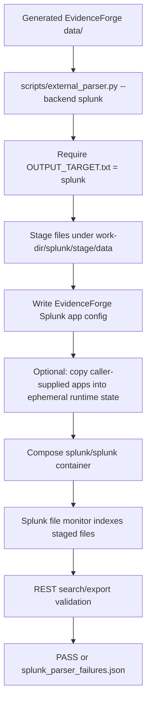

# Splunk Harness

This harness validates generated EvidenceForge logs by running an ephemeral
Splunk Enterprise container against staged files. EvidenceForge generates only
its own Splunk app config, staging layout, REST search/export queries, reports,
and Compose file. It does not vendor Splunk, Splunkbase apps, or TA content.

## Runtime Flow



The full-dataset command is:

```bash
uv run eforge generate <scenario.yaml> --target splunk
uv run python scripts/external_parser.py <data-dir> \
  --backend splunk \
  --accept-splunk-license \
  --work-dir <work-dir>
```

The `--accept-splunk-license` flag is required before Compose startup. The
generated container environment accepts both the Splunk license and Splunk
General Terms for that ephemeral run. Callers remain responsible for Splunk
container licensing and any Splunkbase apps they provide.

For a compact live pipeline smoke, use the repository's purpose-built external
test instead of `minimal.yaml`. The test data is generated by EvidenceForge test
helpers with explicit Zeek/firewall/host directories and includes one record for
every Splunk-supported family:

```bash
EFORGE_ACCEPT_SPLUNK_LICENSE=1 uv run pytest \
  --include-external-parsers \
  --no-cov \
  tests/external_parser/test_splunk_harness.py
```

For manual generated-scenario testing, prefer a sensor-backed scenario such as
`scenarios/branch-office-example/scenario.yaml`. Minimal scenarios without Zeek,
IDS, or firewall sensors intentionally do not produce those source families.

## Generated App Config

EvidenceForge writes an app under:

```text
<work-dir>/splunk/runtime-config-src/apps/evidenceforge_parser_validation/
```

Important files:

| Path | Purpose |
| --- | --- |
| `local/inputs.conf` | File-monitor stanzas for each staged file, with explicit index, host, source, and sourcetype |
| `local/props.conf` | Line breaking, timestamp hints, XML/JSON modes, and REPORT bindings |
| `local/transforms.conf` | Search-time extractions for RFC5424, Cisco ASA, web, and proxy logs |
| `local/indexes.conf` | Dedicated `eforge` index paths |

The harness mounts that generated app into `/opt/splunk/etc/apps/` and mounts
staged logs read-only under `/evidenceforge-data`.

## CIM Mode

`--cim auto|require|off` controls CIM validation.

| Mode | Behavior |
| --- | --- |
| `auto` | Run base Splunk ingest/parse validation. If `--splunk-app` is absent, mark CIM skipped. If apps are present, verify CIM data models are visible. |
| `require` | Fail before startup unless at least one local app path is supplied. |
| `off` | Skip CIM checks even when apps are supplied. |

`--splunk-app <path>` may point to a local Splunk app directory or archive. Apps
are copied or unpacked only into `<work-dir>/splunk/runtime-config-src/` for the
run. EvidenceForge does not download, commit, or redistribute those apps.

## Validation And Artifacts

The harness validates:

- Indexed event counts by sourcetype.
- `_time`, `_raw`, host, source, and sourcetype metadata.
- Required base fields from generated props/transforms and Splunk XML/JSON modes.
- Splunk `_internal` parser warnings/errors from file monitoring, line breaking,
  date parsing, and tailing components.
- CIM data-model visibility when CIM mode is active and apps are supplied.

Useful artifacts:

| Path | Purpose |
| --- | --- |
| `<work-dir>/splunk/parsed/splunk_validation_report.json` | Success report |
| `<work-dir>/splunk/parsed/splunk_parser_failures.json` | Failure report |
| `<work-dir>/splunk/search-results/*.jsonl` | Raw REST search/export results |
| `<work-dir>/splunk/pipeline-logs/splunkd.log` | Recent Splunk daemon logs |
| `<work-dir>/splunk/pipeline-logs/btool-*.txt` | Effective config snapshots |
| `<work-dir>/splunk/stage/data/...` | Staged inputs as Splunk monitored them |
| `<work-dir>/splunk/compose.yaml` | Generated Compose topology |
